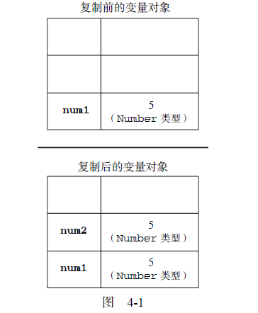
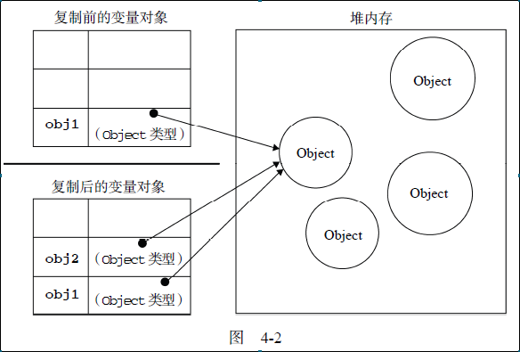

# 第四章 变量、作用域和内存
## 4.1 基本类型和引用类型的值
&nbsp;

### 4.1.2 复制变量值

#### 基本类型的复制

如果从一个变量向另一个变量复制基本类型的值，会在变量对象上创建一个新值，然后把该值复制
到为新变量分配的位置上
```
var num1 = 5;
var num2 = num1;
```
所以num1和num2其实是完全独立的，如图4-1所示:

<br/>



<br/>

#### 引用类型的复制（浅拷贝）

当从一个变量向另一个变量复制引用类型的值时，同样也会将存储在变量对象中的值复制一份放到
为新变量分配的空间中。不同的是，这个值的副本实际上是一个指针，而这个指针指向存储在堆中的一
个对象。所以复制后的值改变会影响原来的值

```
var obj1 = new Object();
var obj2 = obj1;
obj1.name = "Nicholas";
alert(obj2.name); //"Nicholas"
```

如图4-2所示：

<br/>



<br/>

***基本类型和引用类型的指针存放在栈内存中，而引用类型本身存储在堆内存中***

---

### 4.1.3 传递参数

ECMAScript 中所有函数的参数都是按值传递的。也就是说，把函数外部的值复制给函数内部的参
数，就和把值从一个变量复制到另一个变量一样

所以在函数中改变传入的基本类型变量的值不会影响外部变量，而改变传入引用类型的变量值会影响外部变量。

***可以把ECMAScript 函数的参数想象成局部变量，而参数的传入，就是对局部变量的赋值。***

