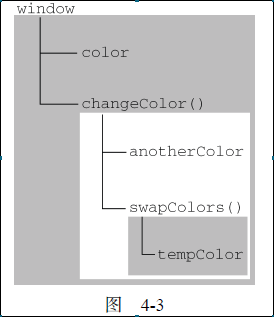
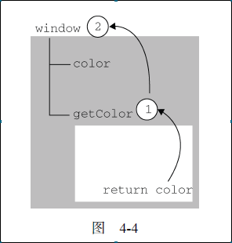

# 第四章 变量、作用域和内存
## 4.2 执行环境
&nbsp;

### 执行环境（execution context，为简单起见，有时也称为“环境”）的概念：

+ window是js中最外层的一个执行环境。

+ 每个函数都有自己的执行环境。

+ 当执行流进入一个函数时，函数的环境就会被推入一个环境栈中。
而在函数执行之后，栈将其环境弹出，把控制权返回给之前的执行环境。(函数的调用栈就是这样来的)。

+ 某个执行环境中的所有代码执行完
毕后，该环境被销毁，保存在其中的所有变量和函数定义也随之销毁（全局执行环境直到应用程序退
出——例如关闭网页或浏览器——时才会被销毁）。

+ 当代码在一个环境中执行时，会创建变量对象的一个**作用域链（scope chain）**。

### 执行环境（execution context，为简单起见，有时也称为“环境”）的概念：

+ 作用域链中
的下一个变量对象来自包含（外部）环境，而再下一个变量对象则来自下一个包含环境。这样，一直延
续到全局执行环境；全局执行环境的变量对象始终都是作用域链中的最后一个对象。

+ 标识符解析是沿着作用域链一级一级地搜索标识符的过程。搜索过程始终从作用域链的前端开始。
然后逐级地向后回溯，直至找到标识符（变量）为止。

如图4-3所示，矩形框就是执行环境，其中的树状图就是作用域链：

**`try-catch` 语句的`catch` 块会接受一个错误信息变量，所以会发生延长作用域链现象**

 

>当在某个环境中读取或写入标识符时，必须通过搜索来确定该标识符实际代表什
么变量。搜索过程从作用域链的前端开始，向上逐级查询与给定名字匹配的标识符。如果在局部环境中找到
了该标识符，搜索过程停止，变量就绪。如果在局部环境中没有找到该变量名，则继续沿作用域链向上
搜索。搜索过程将一直追溯到全局环境的变量对象(window)。如果在全局环境中也没有找到这个标识符，则意味
着该变量尚未声明。作用域链只会从下往上一级级追溯搜索，不可逆*（这也解释了为什么函数内部可以访问外部变量，外部不可访问内部变量。）*

整个搜索过程如图4-4：

;
